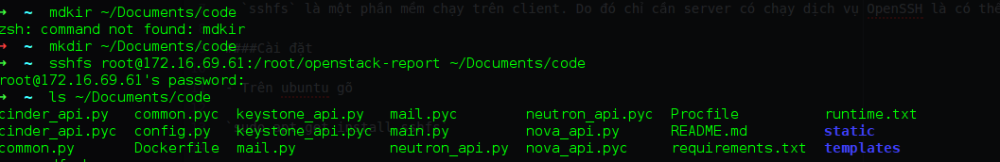
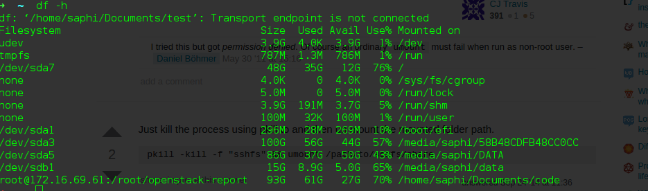

### Mount thư mục trên server về client

- Khi sửa file trên server ta thường dùng trình soạn thảo vi. Nhưng nếu ta muốn code trực tiếp trên server lại sử dụng vi thì đó là ý tưởng không tốt chút nào. Do đó để làm việc trực tiếp với các file trên linux ta có thể mount một thư mục chứa code về client. Lúc này ta dùng các trình soạn thảo ở client có thể dễ dàng modifiy code và được sync tức thời.

-  `sshfs` sẽ làm được việc đó

- `sshfs` là một phần mềm chạy trên client. Do đó chỉ cần server có chạy dịch vụ OpenSSH là có thể làm việc được

####Cài đặt

- Trên ubuntu gõ

`sudo apt-get install sshfs`

####Mount

- Sử dụng lệnh sau để mount một thư mục trên server về client

`sshfs [user@]hostname:/source_dir /dest_dir`

- Còn rất nhiều option ta chạy `sshfs -h` để tìm hiểu thêm

####Demo

- Ta có thể dùng lệnh `df -h` để kiểm tra

